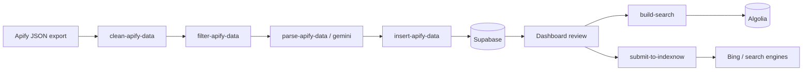

# Data Ingestion & Maintenance Plan

Plan for importing dental clinic data from **Apify Google Maps scraper exports** (JSON) into Supabase, enriching content with AI, and keeping search/SEO indexes up to date.

---

## Overview

The pipeline is a **sequential, file-based ETL** under `tasks/`. Each Apify export is processed through cleaning → deduplication → AI description generation → database insert → downstream index updates.



Clinics land in the database as **`status: pending`** and **`is_active: false`**. They must be reviewed and activated in the dashboard before they appear on the site or in Algolia.

---

## Directory layout

| Path | Purpose |
|------|---------|
| `tasks/data/<batch>.json` | Raw Apify export (input) |
| `tasks/data/parsedData/processed-<batch>.json` | Cleaned & normalized records |
| `tasks/data/parsedData/filtered-processed-<batch>.json` | Records not already in DB (by slug) |
| `tasks/data/parsedData/final-filtered-processed-<batch>.json` | With AI-generated descriptions (insert input) |
| `tasks/data/_old/` | Archived batches from previous runs |

**Batch naming:** Use a short, descriptive slug (e.g. `kuala-lumpur`, `kepong`, `bukit-bintang`). All scripts take this slug as the CLI argument.

---

## Prerequisites

### Environment (`.env.local`)

| Variable | Used by |
|----------|---------|
| `NEXT_PUBLIC_SUPABASE_URL` | filter, insert, build-search |
| `NEXT_PUBLIC_SUPABASE_ANON_KEY` | filter, build-search |
| `SUPABASE_SERVICE_ROLE_KEY` | insert (bypasses RLS) |
| `OPENAI_API_KEY` | `parse-apify-data.ts` |
| `GOOGLE_AI_API_KEY` | `parse-apify-data-gemini.ts` |
| `GOOGLE_SEARCH_API_KEY` / related | Gemini grounding (via `GoogleSearchService`) |
| `NEXT_PUBLIC_ALGOLIA_APP_ID` | build-search |
| `ALGOLIA_SEARCH_ADMIN_KEY` | build-search |
| `NEXT_PUBLIC_BASE_URL` | insert (ImageKit upload via `/api/upload-imagekit`) |

### Runtime

- Node.js with project dependencies installed (`npm install`)
- For **insert**: dev server or production app must be reachable at `NEXT_PUBLIC_BASE_URL` so image uploads work
- For **IndexNow**: sitemaps must exist (`npm run build` generates them via `postbuild`)

---

## Ingestion pipeline (step by step)

Replace `<batch>` with your file slug (without `.json`).

### Step 0 — Export from Apify

1. Run the Google Maps / Places scraper on Apify for the target area or search query.
2. Download the dataset as JSON.
3. Save to `tasks/data/<batch>.json`.

**Expected raw shape** (per record): `title`, `location`, `openingHours`, `placeId`, `address`, `street`, `city`, `state`, `postalCode`, `reviews`, `imageUrls`, `totalScore`, `reviewsCount`, `permanentlyClosed`, etc.

**Quality checks before cleaning:**

- Records should be dental clinics (filter in Apify or manually after export).
- Spot-check coordinates and addresses for the target region (bad geocoding can slip in).
- Prefer exports that include `openingHours` and `reviews` when possible.

---

### Step 1 — Clean & normalize

```bash
npm run clean-data <batch>
```

**Script:** `tasks/clean-apify-data.ts`

**What it does:**

- Strips Apify noise fields (`popularTimesHistogram`, `searchPageUrl`, etc.)
- Normalizes opening hours to `{ day_of_week, open_time, close_time }` (24h)
- Generates `slug` from clinic name
- Maps `imageUrls` → `images`, `phoneUnformatted` → `phone`
- Clears `website` if it contains `healthhub`
- Sets `skip: true` when a website URL exists (legacy flag; parse scripts no longer skip on this)
- Preserves Google reviews when present

**Output:** `tasks/data/parsedData/processed-<batch>.json`

---

### Step 2 — Deduplicate against production

```bash
npm run filter-data <batch>
```

**Script:** `tasks/filter-apify-data.ts`

**What it does:**

- Queries Supabase `clinics` for each record’s `slug`
- Keeps only records where slug does not already exist
- Logs skipped duplicates

**Output:** `tasks/data/parsedData/filtered-processed-<batch>.json`

**Note:** Dedup is **slug-only**. Same clinic with a different slug will not be caught. Consider also checking `place_id` in a future improvement.

---

### Step 3 — Generate descriptions (AI)

Choose **one** parser:

```bash
# OpenAI (default: gpt-4-1106-preview)
npm run parse-data <batch>

# Google Gemini with optional web grounding
npm run parse-data-gemini <batch>
npm run parse-data-gemini <batch> --disable-grounding
```

**Scripts:**

- `tasks/parse-apify-data.ts` — OpenAI
- `tasks/parse-apify-data-gemini.ts` — Gemini + Google Search grounding

**What they do:**

- Skip records that already have a `description`
- Build SEO-oriented prompts from name, address, hours, reviews, ratings
- Write HTML descriptions (`<p>...</p>`, ~150 words)
- Batch with concurrency limits (`batchSize: 10`, `maxConcurrent: 3`)
- Retry failed API calls

**Output:** `tasks/data/parsedData/final-filtered-processed-<batch>.json`

**Cost / time:** This is the slowest, most expensive step. Run on a filtered file only. Re-runs skip records that already have descriptions.

---

### Step 4 — Insert into Supabase

```bash
# Ensure app is running if uploading images locally
npm run dev   # in another terminal, if needed

npm run insert-data <batch>
```

**Script:** `tasks/insert-apify-data.ts`

**What it does (per clinic):**

1. Insert into `clinics` with `source: 'scraped'`, `status: 'pending'`, `is_active: false`
2. Upload Google image URLs to ImageKit via `/api/upload-imagekit`
3. Insert rows into `clinic_images`
4. Insert scraped reviews into `clinic_reviews` (`source: 'scraped'`, `status: 'approved'`)
5. Insert opening hours into `clinic_hours`

**Input file:** `tasks/data/parsedData/final-filtered-processed-<batch>.json`

**Important — hardcoded geography (manual fix required today):**

`insert-apify-data.ts` currently sets fixed IDs:

- `area_id` → Cheras
- `state_id` → Kuala Lumpur

Before inserting a non–KL batch, update these UUIDs in the script (or refactor to resolve `state`/`city` from the record). Wrong IDs will misfile clinics in browse/navigation.

**Other insert caveats:**

- `images` in JSON may be a string in clean step but insert expects an array — verify shape in final JSON before insert
- Image upload is sequential per clinic to avoid rate limits
- Failed clinics are logged; the run continues

---

### Step 5 — Review & activate (dashboard)

**Not automated** — human step in `/dashboard/clinics/review`:

1. Open pending clinics (`status = pending`)
2. Verify name, address, area/state, description quality, images
3. Correct `area_id` / `state_id` if wrong
4. Set `status: approved` and `is_active: true` when ready to publish

Until activated, clinics are **not** included in Algolia (`build-search` filters `is_active = true`).

---

### Step 6 — Rebuild search index

```bash
npm run build-search
```

**Script:** `tasks/build-search.ts`

- Reads all **active** clinics from Supabase
- Pushes to Algolia index `prod_PLACES_v2`

Run after bulk approvals or when search results are stale.

---

### Step 7 — Notify search engines (optional)

```bash
npm run build          # regenerates sitemaps
npm run submit-indexnow
```

**Script:** `tasks/submit-to-indexnow.ts`  
**Docs:** `tasks/README-indexnow.md`

Submits sitemap URLs to IndexNow one at a time (streaming mode, ~2s delay per URL). Use after publishing new clinic pages.

---

## Full command cheat sheet

Example for a new batch named `penang-georgetown`:

```bash
# 1. Place export at tasks/data/penang-georgetown.json

npm run clean-data penang-georgetown
npm run filter-data penang-georgetown
npm run parse-data-gemini penang-georgetown    # or parse-data
# Edit insert-apify-data.ts area_id / state_id if not KL
npm run insert-data penang-georgetown

# After dashboard review & activation:
npm run build-search
npm run build && npm run submit-indexnow
```

---

## Maintenance workflows

### Adding a new geographic area

1. Ensure `states` and `areas` exist in Supabase (dashboard or seed SQL).
2. Scrape on Apify with area-specific search strings.
3. Run pipeline with a new `<batch>` name.
4. Fix `area_id` / `state_id` on insert (script or per-clinic in dashboard).
5. Activate approved listings → `build-search` → IndexNow.

### Refreshing existing clinics (re-scrape)

Current scripts are **insert-only** for new slugs. To refresh data for clinics already in DB:

| Data | Approach |
|------|----------|
| Reviews, hours, rating | Manual dashboard edit, or write an update script keyed on `place_id` / `slug` (not implemented yet) |
| Description | Re-run parse step on a subset; merge descriptions manually or extend script to UPDATE |
| Images | Re-scrape + custom upload script; avoid duplicate ImageKit files |
| Closed permanently | Set `is_permanently_closed` in dashboard or batch SQL |

**Recommended future script:** `update-apify-data.ts` — match on `place_id`, update mutable fields, skip insert.

### Periodic maintenance schedule

| Frequency | Task |
|-----------|------|
| Per batch | Full ingestion pipeline + dashboard review |
| After approvals | `npm run build-search` |
| After deploy / new pages | `npm run build` + `submit-indexnow` |
| Monthly | Spot-check Apify data vs live listings; deactivate closed clinics |
| Quarterly | Audit duplicate slugs / `place_id`; review AI description quality |

### Archiving

Move processed raw and intermediate files to `tasks/data/_old/` after a successful insert and review. Keep `final-filtered-processed-*.json` as the audit trail for what was inserted.

---

## Data model mapping (Apify → Supabase)

| Apify / processed field | Supabase column / table |
|-------------------------|-------------------------|
| `title` | `clinics.name` |
| `slug` | `clinics.slug` (unique) |
| `description` | `clinics.description` |
| `website` | `clinics.website` |
| `street` | `clinics.address` |
| `neighborhood` | `clinics.neighborhood` |
| `city` | `clinics.city` |
| `postalCode` | `clinics.postal_code` |
| `phone` | `clinics.phone` |
| `latitude` / `longitude` | `clinics.latitude`, `clinics.longitude`, `clinics.location` |
| `totalScore` | `clinics.rating` |
| `reviewsCount` | `clinics.review_count` |
| `permanentlyClosed` | `clinics.is_permanently_closed` |
| `placeId` | `clinics.place_id` |
| `openingHours[]` | `clinic_hours` |
| `reviews[]` | `clinic_reviews` |
| `images` (uploaded) | `clinic_images` |
| — | `clinics.source = 'scraped'` |
| — | `clinics.status = 'pending'` (until reviewed) |
| — | `clinics.is_active = false` (until reviewed) |

---

## Known gaps & improvement backlog

1. **Hardcoded `area_id` / `state_id` in insert** — highest priority fix for multi-region ingestion.
2. **No update/reconcile script** — re-scrapes cannot merge into existing rows by `place_id`.
3. **Slug-only dedup** — risk of duplicate clinics under different names.
4. **`images` type inconsistency** — clean step stores string; insert expects array; validate before insert.
5. **`transfer-imagekit-*` scripts** — referenced in `package.json` but files are missing; needed for bulk image migrations.
6. **Cache invalidation** — insert script does not call `CacheInvalidationStrategies`; may need manual revalidate or deploy after bulk publish.
7. **Algolia partial updates** — `build-search` reindexes all active clinics; fine for small batches, consider incremental updates at scale.

---

## Troubleshooting

| Symptom | Likely cause | Fix |
|---------|--------------|-----|
| `Please provide a file name` | Missing CLI arg | Pass `<batch>` slug to every script |
| `Missing Supabase credentials` | `.env.local` not loaded | Check env vars; run from project root |
| Insert fails on images | App not running / wrong `NEXT_PUBLIC_BASE_URL` | Start `npm run dev` or point to production URL |
| All records filtered out | Slugs already in DB | Expected for re-runs; use new scrape or update script |
| Clinics not in search | `is_active = false` | Approve and activate in dashboard, then `build-search` |
| Wrong state/area on site | Hardcoded insert IDs | Fix in dashboard or update insert script |
| OpenAI/Gemini errors | Rate limits / billing | Retry; reduce `maxConcurrent`; use `--disable-grounding` for Gemini |
| IndexNow key not found | Missing key file | Ensure `public/ac7d2e0216af47318d6a6ec99f3b5921.txt` exists |

---

## New batch checklist

- [ ] Apify export saved as `tasks/data/<batch>.json`
- [ ] Spot-check sample records (location, category, hours)
- [ ] `npm run clean-data <batch>`
- [ ] `npm run filter-data <batch>` — review count kept vs skipped
- [ ] `npm run parse-data` or `parse-data-gemini <batch>`
- [ ] Spot-check AI descriptions in `final-filtered-processed-<batch>.json`
- [ ] Set correct `area_id` / `state_id` in insert script (if not KL)
- [ ] App reachable for image uploads
- [ ] `npm run insert-data <batch>` — review failure log
- [ ] Dashboard review: fix geography, approve, activate
- [ ] `npm run build-search`
- [ ] `npm run build && npm run submit-indexnow` (production)
- [ ] Archive inputs to `tasks/data/_old/`

---

## Related files

| File | Role |
|------|------|
| `tasks/clean-apify-data.ts` | Normalize raw Apify JSON |
| `tasks/filter-apify-data.ts` | Remove DB duplicates by slug |
| `tasks/parse-apify-data.ts` | OpenAI descriptions |
| `tasks/parse-apify-data-gemini.ts` | Gemini descriptions + grounding |
| `tasks/insert-apify-data.ts` | Supabase + ImageKit insert |
| `tasks/build-search.ts` | Algolia full reindex |
| `tasks/submit-to-indexnow.ts` | IndexNow URL submission |
| `tasks/README-indexnow.md` | IndexNow details |
| `supabase/local-schema.sql` | Clinics schema reference |
| `app/(dashboard)/dashboard/clinics/review/page.tsx` | Pending clinic review UI |
